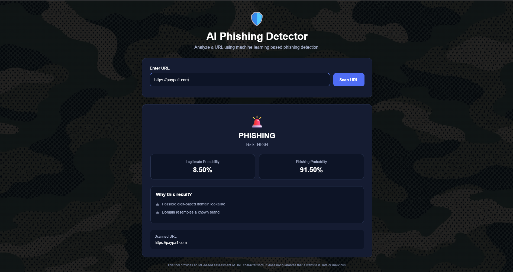

# AI-Powered Phishing Detection System

An AI-powered phishing URL detection system that analyzes URL-based features and uses a Machine Learning model to classify URLs as **Legitimate** or **Phishing**.

The project combines **Python, Scikit-learn, Flask, HTML, CSS, and JavaScript** to provide a web-based URL scanning interface with prediction probabilities, risk classification, and human-readable explanations.

---

## Demo



The application provides ML-based URL classification, probability estimates, risk assessment, and human-readable indicators explaining selected URL characteristics.

> **Note:** The demo uses `paypa1.com` as a controlled brand-lookalike test case. A model prediction is a risk assessment based on URL characteristics and the training dataset, not proof that a website is malicious.

---

## Model Performance

The final V2 Random Forest was evaluated using a domain-aware holdout split with **zero domain overlap** between training and testing domains.

| Metric | Result |
|---|---:|
| Accuracy | **99.69%** |
| Precision | **99.81%** |
| Recall | **99.39%** |
| F1 Score | **99.60%** |
| False Positives | 33 |
| False Negatives | 105 |

**Evaluation:** 235,370 URLs · 175,509 unique domains · 34 URL-based features

---

## 🎯 Project Objective

The objective of this project is to develop a machine-learning-based system capable of identifying potentially phishing URLs using lexical and structural characteristics of URLs.

The system extracts features from a submitted URL, processes them through a trained Random Forest classifier, and returns:

- URL classification
- Legitimate probability
- Phishing probability
- Risk level
- Explainable indicators behind the result

> **Important:** This project performs URL-based analysis only. A prediction is not proof that a website is malicious or safe.

---

## ✨ Features

### 🔍 URL Analysis

Extracts lexical and structural characteristics from URLs, including:

- URL length
- Hostname characteristics
- Domain characteristics
- Path characteristics
- Digit and letter counts
- Suspicious words
- HTTPS usage
- IP-address usage
- Punycode
- Percent encoding
- Domain entropy
- Digit-based domain substitutions
- Brand similarity indicators

### 🤖 Machine Learning

- Random Forest classifier
- 34 engineered URL features
- Class-balanced training
- Domain-aware evaluation
- Probability-based prediction

### 📊 Risk Classification

The application converts the model's phishing probability into:

- **LOW**
- **MEDIUM**
- **HIGH**

### 💡 Explainable Results

The application provides human-readable indicators such as:

- Possible digit-based domain lookalike
- Domain resembles a known brand
- Multiple digits in hostname
- Suspicious security-related words
- Deep URL path structure
- IP address usage

### 🌐 Web Application

The system includes:

- Flask REST API
- Browser-based frontend
- Real-time URL scanning
- Prediction probabilities
- Risk classification
- Explanation display

### 🔐 Basic Security Hardening

The Flask application includes security-related HTTP headers:

- `X-Content-Type-Options: nosniff`
- `X-Frame-Options: DENY`
- `Referrer-Policy: no-referrer`

It also validates API input and limits URL length.

### 🧪 Automated Testing

The project includes automated tests for:

- Feature extraction
- ML prediction
- API endpoints
- Input validation
- Security headers
- Explanation generation

Current test suite:

**18/18 tests passing**

---

## 🏗️ System Architecture

The system follows a simple client-server machine learning architecture:

```text
                    ┌─────────────────────┐
                    │       User          │
                    │   Enters URL        │
                    └──────────┬──────────┘
                               │
                               ▼
                    ┌─────────────────────┐
                    │   Web Frontend      │
                    │   HTML/CSS/JS       │
                    └──────────┬──────────┘
                               │
                         HTTP POST
                               │
                               ▼
                    ┌─────────────────────┐
                    │     Flask API       │
                    │  Input Validation   │
                    └──────────┬──────────┘
                               │
                               ▼
                    ┌─────────────────────┐
                    │ Feature Extraction  │
                    │       V2            │
                    │     34 Features     │
                    └──────────┬──────────┘
                               │
                               ▼
                    ┌─────────────────────┐
                    │   Random Forest     │
                    │   ML Classifier     │
                    └──────────┬──────────┘
                               │
                 ┌─────────────┼─────────────┐
                 │             │             │
                 ▼             ▼             ▼
            Prediction   Probability      Risk
                 │             │             │
                 └─────────────┼─────────────┘
                               │
                               ▼
                    ┌─────────────────────┐
                    │ Explanation Engine  │
                    │ Suspicious Signals  │
                    └──────────┬──────────┘
                               │
                               ▼
                    ┌─────────────────────┐
                    │   Frontend Result   │
                    │ Prediction + Risk   │
                    │ Probability + Why   │
                    └─────────────────────┘
```

### Processing Flow

1. The user enters a URL through the web interface.
2. The frontend sends the URL to the Flask API.
3. The API validates the input.
4. The feature extraction module generates 34 URL-based features.
5. The trained Random Forest model analyzes the feature vector.
6. The system generates:
   - Prediction
   - Legitimate probability
   - Phishing probability
   - Risk level
7. The explanation engine identifies relevant URL characteristics.
8. The results are returned to the frontend and displayed to the user.

---

## 📊 Dataset

The model was trained and evaluated using the **UCI PhiUSIIL Phishing URL Dataset**.

The dataset was cleaned before training by removing:

- Missing URLs
- Duplicate URLs

After preprocessing:

- **Total URLs:** 235,370
- **Legitimate:** 134,850
- **Phishing:** 100,520
- **Unique domains:** 175,509

The project uses the following label mapping:

| Label | Meaning |
|---|---|
| `0` | Legitimate |
| `1` | Phishing |

---

## 🧠 Feature Engineering

The V2 feature extractor generates **34 URL-based features**.

Features include:

### URL Structure

- URL length
- Hostname length
- Path length
- Query length
- Fragment length
- Path depth
- Slash count
- Dot count
- Hyphen count
- Underscore count

### Character Analysis

- Digit count
- Letter count
- Hostname digit count
- Hostname letter count
- Domain digit count
- Domain hyphen count
- Domain entropy

### Security Indicators

- HTTPS usage
- IP address detection
- Punycode detection
- Percent encoding
- Suspicious security-related words

### Brand / Lookalike Indicators

- Brand similarity
- Exact brand match
- Digit substitution
- Brand lookalike score

These features are extracted directly from the URL without visiting the target website.

---

## 🤖 Machine Learning Model

The project uses a **Random Forest Classifier**.

### Configuration

```text
n_estimators = 200
random_state = 42
class_weight = balanced
n_jobs = -1
```

The model predicts:

```text
0 → Legitimate
1 → Phishing
```

The model also provides class probabilities, which are used by the application to calculate the displayed risk level.

---

## 🔬 Domain-Aware Evaluation

To reduce the risk of overly optimistic evaluation caused by URLs from the same domains appearing in both training and testing data, the final evaluation uses a **domain-aware train/test split**.

### Evaluation Setup

- Training URLs: **191,335**
- Testing URLs: **44,035**
- Training domains: **140,407**
- Testing domains: **35,102**
- Domain overlap: **0**

The final test set therefore contains domains that were not present in the training set.

### Final Results

| Metric | Score |
|---|---:|
| Accuracy | **99.69%** |
| Precision | **99.81%** |
| Recall | **99.39%** |
| F1 Score | **99.60%** |
| False Positives | **33** |
| False Negatives | **105** |

### Confusion Matrix

```text
                    Predicted
                 Legitimate  Phishing

Actual Legitimate    26915       33
Actual Phishing        105    16982
```

> These results represent performance on the prepared UCI dataset under the domain-aware evaluation setup. They should not be interpreted as guaranteed real-world phishing detection accuracy.

---

## ⚠️ Limitations

Although the system achieves strong performance on the prepared evaluation dataset, it has several important limitations.

### 1. URL-Only Analysis

The system analyzes the URL string and does not inspect the actual website.

It does not currently analyze:

- HTML content
- JavaScript behavior
- Page screenshots
- Redirect chains
- DNS records
- TLS certificates
- Domain registration information
- IP/domain reputation
- Website content
- External threat-intelligence feeds

Therefore, the prediction should be treated as a **risk indicator**, not definitive proof of malicious activity.

### 2. Machine Learning Limitations

The model learns patterns present in its training dataset. Real-world phishing campaigns can use new techniques or URL patterns that were not represented in the dataset.

This means strong dataset performance does not guarantee equivalent performance against previously unseen real-world attacks.

### 3. Explainability Limitations

The displayed explanations are based on predefined URL characteristics.

They describe suspicious signals detected in the URL but do not represent the internal reasoning of the Random Forest model.

For example, the model may classify a URL as phishing even when the explanation engine does not identify a major suspicious characteristic.

### 4. Brand Lookalike Detection

The project includes brand similarity and digit-substitution features, but these features do not constitute a complete typosquatting detection system.

The current implementation does not verify:

- Domain ownership
- Registration details
- Certificate identity
- Actual brand impersonation
- Website content

### 5. Risk Thresholds

The application's LOW, MEDIUM, and HIGH risk categories are application-level thresholds based on the predicted phishing probability.

They are not calibrated probability estimates or a formal industry risk standard.

---

## 🚀 Future Improvements

Potential future versions could extend the system with additional security intelligence.

### Threat Intelligence

Integrate trusted threat-intelligence sources to enrich URL analysis with:

- Domain reputation
- IP reputation
- Known phishing reports
- Malware indicators
- Blacklists and blocklists

### Website Content Analysis

Future versions could analyze:

- HTML structure
- Login forms
- External scripts
- Suspicious JavaScript
- Hidden elements
- Credential collection indicators

### Redirect Analysis

Add safe redirect-chain analysis to identify suspicious intermediate domains.

### DNS & Domain Intelligence

Add analysis of:

- DNS records
- Domain age
- WHOIS information
- Nameservers
- TLS certificate information

### Advanced Machine Learning

Future experimentation could include:

- Gradient boosting
- XGBoost
- LightGBM
- Neural networks
- Ensemble models

These should only be introduced if they provide meaningful improvements over the current baseline.

### Security Dashboard

A future version could provide:

- Scan history
- Risk statistics
- Detection trends
- Feature analysis
- Administrative dashboard

### Deployment

The application could eventually be deployed using a production WSGI server and a cloud platform with appropriate security controls.

---

## 🛠️ Installation & Setup

### Prerequisites

Make sure the following are installed:

- Python 3.10+
- Git
- VS Code or another Python-compatible IDE

### 1. Clone the Repository

```bash
git clone <YOUR_GITHUB_REPOSITORY_URL>
cd AI-Phishing-Detector
```

### 2. Create a Virtual Environment

#### Windows

```powershell
python -m venv venv
venv\Scripts\activate
```

#### Linux/macOS

```bash
python3 -m venv venv
source venv/bin/activate
```

### 3. Install Dependencies

```bash
pip install -r requirements.txt
```

The required Python packages are listed in `requirements.txt`.

### 4. Run the Application

From the project root:

```powershell
python -m app.app
```

The Flask server will start at:

```text
http://127.0.0.1:5000
```

Open the web interface at:

```text
http://127.0.0.1:5000/ui
```

### 5. Using the Scanner

1. Open the web interface.
2. Enter a URL in the input field.
3. Click **Scan URL**.
4. The application extracts URL features.
5. The trained model generates the prediction.
6. The result displays:
   - Prediction
   - Risk level
   - Legitimate probability
   - Phishing probability
   - Explanation signals

---

## 🧪 Testing

Run the complete automated test suite:

```powershell
python -m unittest discover -s tests -v
```

Current result:

```text
18 tests
18 passed
0 failed
```

Individual test suites can also be executed:

```powershell
python -m unittest tests.test_features -v
```

```powershell
python -m unittest tests.test_predictor -v
```

```powershell
python -m unittest tests.test_api -v
```

---

## 📁 Project Structure

```text
AI-Phishing-Detector/
│
├── app/
│   ├── __init__.py
│   ├── app.py
│   └── predictor.py
│
├── dataset/
│   └── phishing_urls.csv
│
├── model/
│   └── final_model.pkl
│
├── src/
│   ├── feature_extraction.py
│   ├── feature_extraction_v2.py
│   ├── train_model.py
│   ├── train_model_v2.py
│   ├── predict.py
│   ├── predict_v2.py
│   ├── evaluate_final_model.py
│   ├── evaluate_domain_split_v2.py
│   ├── compare_models.py
│   └── ...
│
├── tests/
│   ├── test_features.py
│   ├── test_predictor.py
│   └── test_api.py
│
├── frontend/
│   ├── index.html
│   ├── style.css
│   ├── script.js
│   └── camo_bg.png
│
├── .gitignore
├── README.md
└── requirements.txt
```

---

## 🔐 Responsible Use

This project is intended for **educational, research, and defensive cybersecurity purposes**.

The system should be used to analyze URLs that you are authorized to investigate.

A model prediction should not be treated as definitive proof that a website is malicious or legitimate.

---

## 📌 Project Status

**Current Status: Functional Prototype**

The current version includes:

- Machine-learning-based URL classification
- 34 URL-based features
- Domain-aware model evaluation
- Flask REST API
- Web-based scanning interface
- Risk classification
- Explainable URL indicators
- Input validation
- Basic security headers
- Automated testing

**Test Suite:** 18/18 passing

---