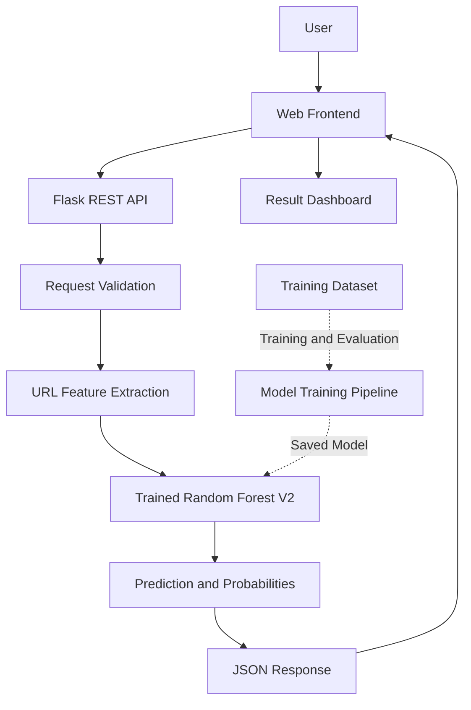

# System Architecture

## 1. Project Overview

The AI-Powered Phishing Detection System is a machine-learning-based web application that analyzes URL characteristics and predicts whether a URL resembles a legitimate or phishing URL.

The application consists of a web frontend, a Flask REST API, a URL feature extraction module, and a trained Random Forest classifier.

## 2. Architecture Diagram

## 3. Main Components

### Frontend

**Location:** `frontend/`

Technologies: HTML, CSS and JavaScript.

Responsibilities:
- Accept a URL from the user.
- Send a JSON request to the prediction API.
- Display the classification result and model probabilities.
- Present technical URL characteristics and explanatory information.

### Flask REST API

**Location:** `app/app.py`

Responsibilities:
- Serve the web interface and frontend assets.
- Validate incoming requests and URL formats.
- Enforce request-size limits.
- Return predictions as JSON.
- Handle errors and add security-related HTTP headers.

### Prediction Module

**Location:** `app/predictor.py`

Responsibilities:
- Load and use the trained model.
- Coordinate feature extraction and prediction.
- Produce the result, probabilities, risk assessment and explanation.

### Feature Extraction

**Location:** `src/feature_extraction_v2.py`

The V2 feature extractor calculates 34 URL-related features, including URL length, hostname characteristics, path structure, suspicious terms, and selected brand-lookalike indicators.

### Machine Learning Model

**Location:** `model/final_model.pkl`

The selected V2 model is a trained Random Forest classifier.

It uses the extracted features to predict a class and estimate class probabilities. These probabilities are model outputs, not guarantees of the URL's safety or maliciousness.

### Dataset and Training Pipeline

**Locations:**
- `dataset/phishing_urls.csv`
- `src/train_model_v2.py`
- `src/evaluate_final_model.py`

The dataset and training scripts support model development and evaluation. The saved model is used during normal prediction.

## 4. Prediction Workflow

1. The user submits a URL through the frontend.
2. The frontend sends a POST request to `/api/predict`.
3. The Flask API validates the request and URL format.
4. The prediction module extracts the required URL features.
5. The trained model predicts the class and class probabilities.
6. The API returns the result as JSON.
7. The frontend displays the prediction and supporting information.

## 5. Evaluation Summary

The V2 Random Forest achieved the following results on a domain-aware holdout evaluation of the UCI PhiUSIIL dataset:

- Accuracy: 99.69%
- Precision: 99.81%
- Recall: 99.39%
- F1 score: 99.60%
- Domain overlap between training and testing sets: 0

These results describe performance on the evaluated dataset and must not be interpreted as guaranteed real-world phishing detection accuracy.

## 6. Security Considerations

- Validate user input before prediction.
- Enforce request-size limits.
- Return generic error responses for unexpected failures.
- Keep Flask debug mode disabled.
- Treat the model output as a prediction rather than proof of malicious activity.
- Do not expose the development server directly to the public internet.
- Review model-file integrity and dependency security before deployment.

## 7. Known Limitations

- Classification is based on URL characteristics, not a complete inspection of website content.
- Legitimate URLs may be flagged incorrectly.
- Phishing URLs may be missed.
- Model probabilities may not be well calibrated for real-world traffic.
- Performance may change when evaluated on newer or substantially different URL distributions.

## 8. Future Improvements

- Evaluate the model on a temporally separated, independently sourced dataset.
- Improve probability calibration and threshold selection.
- Add additional evaluation for brand impersonation and adversarial URLs.
- Introduce controlled monitoring and logging for a production deployment.
- Perform a deployment-focused security review.
